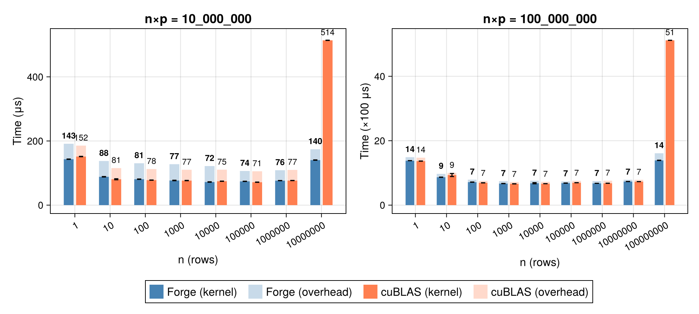
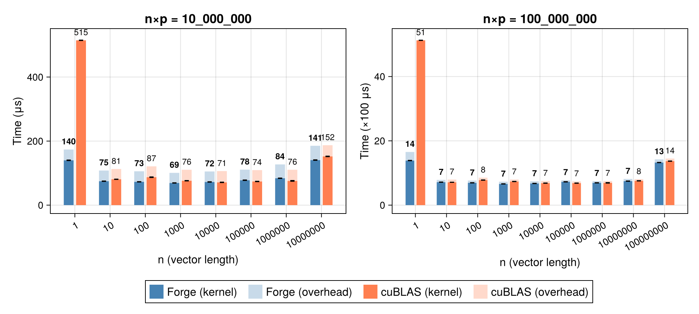
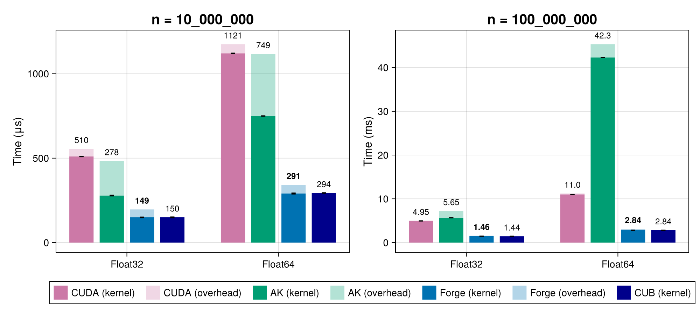
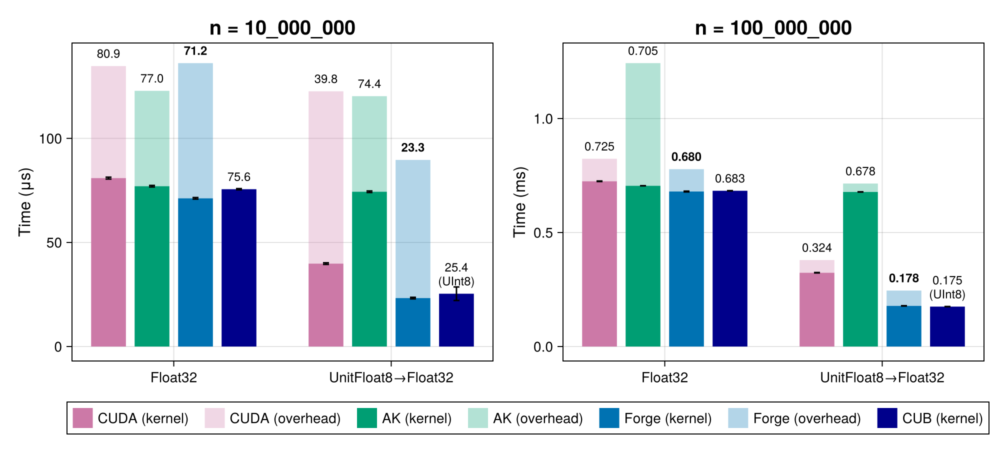
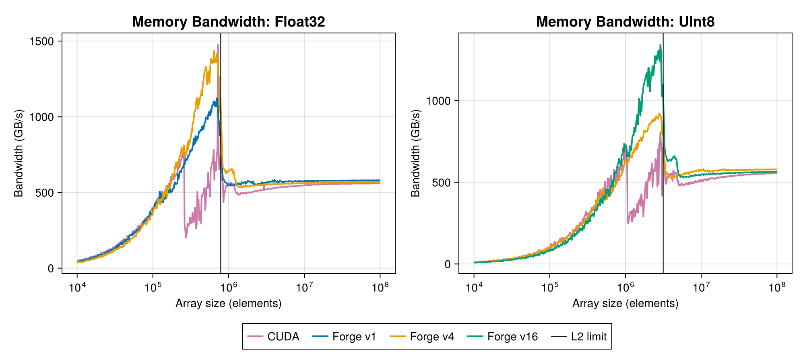

# KernelForge.jl

High-performance, portable GPU primitives for Julia — a pure Julia
implementation delivering performance competitive with optimized CUDA C++
libraries.

<table>
  <tr>
    <td align="center"></td>
    <td align="center"></td>
  </tr>
  <tr>
    <td align="center"></td>
    <td align="center"></td>
  </tr>
  <tr>
    <td align="center" colspan="2"></td>
  </tr>
</table>

<sub>Benchmarked on an <b>NVIDIA A40</b> (Ampere) against optimized CUDA C++
baselines (CUB / cuBLAS). More GPUs (RTX 1000, MI300X) and raw CSV data in the
<a href="https://github.com/epilliat/KernelForge-benchmarks"><b>KernelForge-benchmarks</b></a>
repo.</sub>

## Links

- 📄 **Paper** — [arXiv:2603.18695](https://arxiv.org/pdf/2603.18695)
- 📖 **Documentation** — [epilliat.github.io/KernelForge.jl](https://epilliat.github.io/KernelForge.jl/stable/) — API reference & examples
- 🌐 **Homepage** — [epilliat.github.io/software](https://epilliat.github.io/software/software.html)
- 📊 **Benchmarks** — [KernelForge-benchmarks](https://github.com/epilliat/KernelForge-benchmarks) — raw results across GPUs

## Installation

```julia
using Pkg
Pkg.add("KernelForge")
```

## Quick start

```julia
using KernelForge, CUDA   # or AMDGPU

x = CUDA.rand(Float32, 10^6)

# Reduction with a custom map + operator
total = KernelForge.mapreduce(abs2, +, x)      # sum of squares

# Prefix scan (supports non-commutative ops)
dst = similar(x)
KernelForge.scan!(+, dst, x)                    # cumulative sum

# Matrix–vector product
A = CUDA.rand(Float32, 1000, 500)
v = CUDA.rand(Float32, 500)
y = KernelForge.matvec(A, v)                    # y ≈ A * v

# Radix sort, in place
KernelForge.sort!(x)
```

## Features

- **Map-reduce** with custom functions and operators, supporting arbitrary dimensions and multidimensional arrays
- **Prefix scan** supporting non-commutative operations
- **Matrix-vector operations** with customizable element-wise and reduction operations
- **Matrix-matrix product** (`gemm`) with customizable element-wise, reduction and
  epilogue operations, all four transpose states, and an opt-in tensor-core path
- **Search** — `findfirst`, `findlast`, `argmax`, `argmin` on GPU arrays
- **Vectorized copy** with configurable load/store widths
- Views and strided arrays supported throughout

## Backends

CUDA (NVIDIA) and AMDGPU (AMD) via weak dependencies; the backend is selected
through KernelAbstractions extensions. Tested on NVIDIA A40, RTX 1000, and AMD
MI300X.

## Sponsors

KernelForge.jl is an open-source project maintained in my personal time.
If this package is useful to you — especially in a production or HPC setting —
you can support its development and maintenance via
[GitHub Sponsors](https://github.com/sponsors/epilliat).

Corporate sponsors receive priority support on issues and an acknowledgment
in the documentation.

Thanks to the people who support KernelForge.jl!

- [@PraneethMerugu](https://github.com/PraneethMerugu)

## License

MIT
